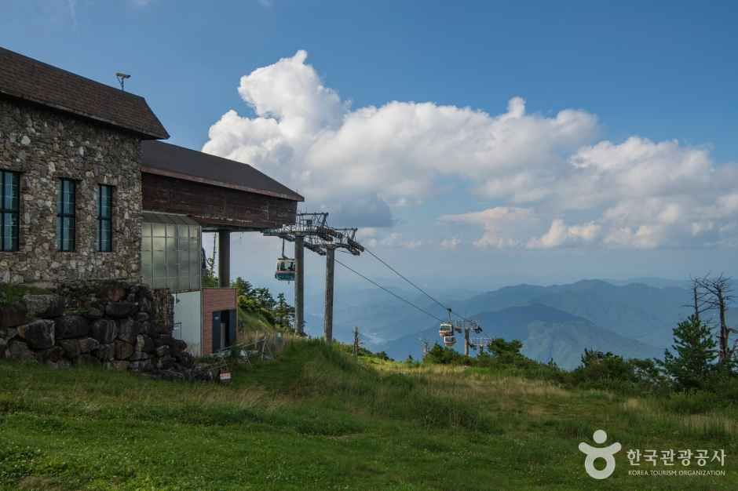
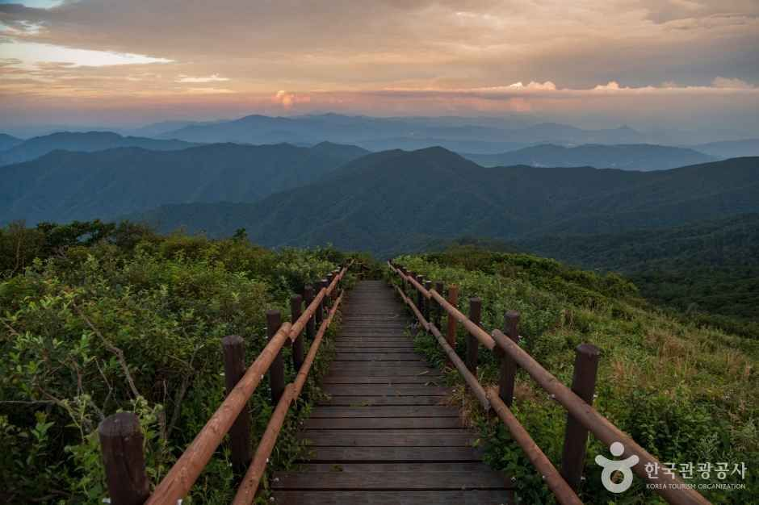

# 무주 가볼만한곳, 덕유산 단풍은 곤돌라로 올라가요

> 공개 발행: 2026-09-29
> URL: https://blog.naver.com/witchbloom82/224425684980
> 본문15 / 강조16 bold / #F02C8C / 큰 소제목 인용구4 19 normal
> 2026-09-29 기존 공개글 수정 반영. 3초요약·보조 소제목은 인용구2. 이미지 최종 RAW 예외 근거는 STATUS 참조.
> HTML/네이버 장소카드는 아래 주석 위치에 실제 삽입됨. 주석을 본문 텍스트로 노출하지 않는다.

가을 산은 보고 싶은데, 긴 오르막은 망설여질 때가 있죠.

무주 덕유산에서는 **곤돌라에 앉아 설천봉까지** 올라갈 수 있어요.

발아래 숲과 겹겹이 이어지는 능선. 이번 단풍 여행은 정상 욕심을 내려놓고, 높은 곳의 풍경을 천천히 바라보는 코스로 잡아보세요.

65세 이상이라면 신분증을 챙기세요. 곤돌라 요금도 30% 할인받을 수 있어요.

## 📌 3초 요약

① 곤돌라로 해발 1,520m 설천봉까지. 향적봉 등산은 선택이에요.

② 성인 왕복 25,000원. **65세 이상 신분증 확인 후 30% 할인**이에요.

③ **10월 주말·공휴일은 사전예약**부터. 서울행 귀경 버스도 먼저 확인하세요.

※ 2026.9.29 공식 안내 확인. 사진은 한국관광공사 자료사진으로, 올해 단풍 현황을 촬영한 사진은 아니에요. 물드는 정도는 고도와 날씨에 따라 달라요.

## 🍂 등산 없이 어디까지 볼 수 있나요?

### 🚠 곤돌라 창밖으로 숲과 능선 보기
산 아래에서 걷기 시작하는 대신, 곤돌라로 높이를 올리는 코스예요. 올라가는 길의 숲과 멀리 겹쳐지는 산줄기를 여행의 첫 풍경으로 잡아보세요.

### 🌄 설천봉에서 머물기
**설천봉 도착 → 주변 풍경 감상 → 쉬었다가 곤돌라 하행.**
등산을 빼고도 높은 산의 전망을 즐길 수 있는 기본 동선이에요. 전망은 안개와 구름의 영향을 받아요.

### 🥾 향적봉은 체력에 따라 선택
리조트 안내는 설천봉에서 향적봉까지 도보 약 20분이에요. 오르막과 계단이 있는 산길이므로 왕복·휴식 시간을 따로 잡으세요. **곤돌라가 향적봉 정상까지 가는 것은 아니에요.**

걷는 부담을 줄이고 싶다면 설천봉에서 돌아와도 좋아요. 휠체어나 보행 보조기 이용자는 승하차와 현장 이동 가능 범위를 리조트에 먼저 확인하세요. 전 구간 무장애 코스로 단정할 수는 없어요.

## 🎟 요금과 65세 할인은 어떻게 받나요?

왕복 / 성인 25,000원 · 소인 20,000원
편도 / 성인 20,000원 · 소인 16,000원

36개월 미만은 무료, 36개월~초등학생은 소인 요금이에요.
국가유공자·보훈대상자 본인은 30% 할인 대상이에요.
군인·경찰·소방관은 본인과 가족관계증명서 범위 내 4인까지 30% 할인 안내가 있어요.
장애인 1~3급은 동반 1인 포함 30% 할인이에요. 해당 증빙과 적용 조건은 공식 안내를 확인하세요.
덕유산 국립공원 입장료는 없으며, 곤돌라 이용료는 별도예요.

**65세 이상은 신분증 제시 시 30% 할인.**
성인 왕복 정상가에 적용하면 **17,500원**으로 계산돼요. 온라인 일반권부터 결제하지 말고, 할인 적용·발권 방법을 예약 안내에서 확인하세요.

10월~다음 해 2월의 주말·공휴일은 사전예약 대상이에요. 평일은 현장 발권 안내예요. 10~11월 주말·공휴일 현장 판매는 예약 잔여분에 한정되므로 예약 없이 출발하지 않는 편이 좋아요.

예약은 탑승일 포함 2주 전 17시에 열려요. 왕복권도 올라가는 편을 예약하며, 내려오는 편만 이용할 때는 설천봉에서 편도권을 구입해요.

주소: 전북특별자치도 무주군 설천면 만선로 185. 설천하우스 관광곤돌라 탑승장으로 이동하세요.

[🔗 곤돌라 공식 예약·예매 안내](https://www.mdysresort.com/gondora/20011525_reserve_gondora1.asp)

<!-- 네이버 네이티브 장소카드: 무주덕유산곤도라 / 전북특별자치도 무주군 설천면 만선로 185 -->

## 🕒 몇 시까지 올라가고 내려와야 하나요?

**8/31~11/1 공식 게시 시간표**
월~목 / 상행 10:00~16:00 · 하행 16:30까지
금 / 상행 10:00~16:30 · 하행 17:00까지
토 / 상행 09:00~17:00 · 하행 17:30까지
일 / 상행 09:00~16:00 · 하행 16:30까지

**11/2부터는 주말 시간이 달라져요.**
11/2~12/12 게시표 기준 토요일 상행 09:30~16:30·하행 17:00, 일요일 상행 09:30~16:00·하행 16:30이에요. 월~금은 위와 같아요.

위 시간은 상·하행 운행시간이며 별도의 매표 마감시각을 뜻하지 않아요. 공식표에는 연도가 따로 표시되지 않아 2026.9.29 열람 기준으로 정리했어요. 공휴일 적용 시간과 기상·정비 변동은 방문일 공지를 다시 확인하세요.

단풍철에는 줄 서는 시간도 일정에 넣으세요. **돌아갈 셔틀 시각부터 정한 뒤** 식사와 하산 시간을 앞당겨 잡는 편이 편해요.

[🔗 곤돌라 공식 요금·운행시간](https://www.mdysresort.com/gondora/intro_gon.asp)
[🔗 무주덕유산리조트 공식 홈페이지·공지](https://www.mdysresort.com/)

## 🚌 대전·서울에서 차 없이 갈 수 있나요?

대전 출발 / **대전복합터미널 → 무주공용버스터미널 → 셔틀 또는 택시 → 설천하우스 곤돌라 탑승장.**
리조트 안내상 대전~무주 버스는 약 50분이에요. 리조트까지의 전체 시간이 아니므로 환승 시간을 더해야 해요.

서울 출발 / 서울남부터미널 → 무주 버스는 공식 안내상 약 2시간 30분.
기차를 이용하면 서울역 → 대전역 → 대전복합터미널 이동 → 무주 순서예요. 대전역과 복합터미널은 서로 다른 곳이에요.

출발편은 여행 날짜를 넣어 예매 화면에서 확인하세요. 무주 도착이 늦어 오전 셔틀을 놓친다면 택시를 예비 수단으로 잡으세요. 목적지는 **‘설천하우스 관광곤돌라 탑승장’**으로 분명히 말하는 게 좋아요.

[🔗 티머니 시외버스 통합예매](https://txbus.t-money.co.kr/)
터미널 주소: 전북특별자치도 무주군 무주읍 한풍루로 351. 리조트 셔틀은 터미널 정문이 아닌 별도 승차장을 확인하세요.

[🔗 리조트 공식 대중교통 안내](https://www.mdysresort.com/guide/way_search.asp)

<!-- 네이버 네이티브 장소카드: 무주공용버스터미널 / 전북특별자치도 무주군 무주읍 한풍루로 351 -->

**무료 셔틀 / 2026.9.1부터 적용된 공식표**
무주 P1 출발 → 리조트 도착
05:00 → 05:55 / 07:20 → 08:20
10:30 → 11:25 / 16:30 → 17:00

P1은 ‘무주관광안내소 위 주차장’이에요. 터미널 승차장과 혼동하지 마세요. 첫 세 편은 산림조합에서도 P1 출발 2분 뒤 타지만, 16:30편은 P1만 안내돼 있어요.

리조트 출발 → 무주 P1 도착
09:30 → 10:15 / 15:30 → 16:25
18:30 → 19:25 / 21:10 → 22:07

리조트 승차 지점에는 만선하우스·티롤사거리·설천하우스·웰컴센터 뒤 조각공원이 안내돼 있어요. 위 출발시각을 **각 정류장 도착시각으로 보면 안 돼요.** 설천하우스 승차시각과 위치는 당일 확인하세요.

15인승 솔라티 무료 운행이라 만석·지연에 대비해야 해요. 겨울 전용 단지 내 순환버스를 가을에도 탈 수 있다고 가정하지 마세요. 문의 063-320-7113.

[🔗 리조트 공식 셔틀 시간표·승차장](https://www.mdysresort.com/guide/shuttle_bus.asp)

## 🍽 식사와 귀경은 어떻게 묶을까요?

식사는 설천봉 레스토랑에서 해결하면 추가 이동을 줄일 수 있어요. 공식 메뉴판에는 불고기 나물 비빔밥 13,000원, 어묵꼬치우동 12,000원이 안내돼 있어요. 운영은 곤돌라 일정에 연동되니 하행 전에 식사까지 마쳐주세요. 문의 063-320-7717.

[🔗 리조트 공식 식음시설·메뉴 안내](https://www.mdysresort.com/facility/food.asp)

### 📍 가벼운 코스 예시
무주 P1 10:30 셔틀 → 리조트 11:25 도착
→ 곤돌라 탑승·설천봉 전망·점심
→ 대기시간을 감안해 일찍 하행
→ 리조트 15:30 출발 셔틀 → P1 16:25.
리조트 도착 후 설천하우스까지 이동시간은 별도예요. 하차 지점과 현장 이동수단을 063-320-7113으로 문의하고 곤돌라 예약시각을 맞추세요. 연결이 안 맞으면 무주터미널에서 설천하우스로 택시를 이용하는 편이 단순해요.

**서울남부행 막차 16:35에 바로 잇지 마세요.**
무주군의 2026.6.19 시외버스 첨부표상 무주읍→서울남부는 09:35·10:55·14:40·16:35예요. P1 16:25 도착 후에는 10분뿐이고 터미널 이동도 남아, 놓칠 위험이 커요.

무주에서 서울남부행 버스를 타려면 더 일찍 택시 등으로 터미널에 이동하세요. 오후 셔틀을 이용한다면 무주→대전 17:45 등 여유 있는 편을 확인한 뒤 서울행으로 환승하는 방법을 고려하세요. 같은 군청표상 대전행 막차는 20:40이지만, 서울까지 이어지는 열차·버스는 별도로 확인해야 해요.

버스표는 모두 무주에서 나가는 방향이에요. 서울·대전 출발편과 바꿔 읽지 마세요. 실제 여행일 운행·좌석은 예매 화면에서 최종 확인하세요.

[🔗 무주군 공식 교통 안내·최신 첨부 시간표](https://muju.go.kr/index.9is?contentUid=4028a6d288d81dbb0189b03d68b50c68)

## 🎒 떠나기 전 무엇을 챙길까요?

□ 65세 할인용 신분증
□ 주말·공휴일 곤돌라 예약 확인
□ 바람 막을 겉옷, 미끄럽지 않은 신발
□ 셔틀 승차 위치와 귀경표 확인
□ 출발 당일 기상·곤돌라 운행 공지

### 📞 전화 한 곳씩
리조트·곤돌라 안내 / 063-322-9000
셔틀 문의 / 063-320-7113

곤돌라로 설천봉에 올라 풍경을 보고, 향적봉은 그날 몸 상태에 따라 선택하세요. 많이 걷는 것보다 편하게 돌아오는 일정이 이번 여행의 기준이면 좋겠어요.

### 함께 볼 여행글
산 대신 가을 꽃길이 끌린다면, 쉬는 날부터 확인하고 떠나는 철원 나들이도 참고해 보세요.
[🔗 철원 가볼만한곳 · 고석정 꽃밭](https://blog.naver.com/witchbloom82/224404822258)

💗 같이 갈 분께 이 글을 보내고, 곤돌라 예약 날짜부터 골라보세요. 설천봉에서 쉬는 코스와 향적봉까지 걷는 코스 중 어느 쪽이 더 끌리세요?

사진 출처: 한국관광공사, 공공누리 제1유형(출처표시). 설천봉·덕유산 자료사진이며 올해 단풍 현황 사진이 아닙니다. 원본 풍경과 출처 표시는 그대로 사용했습니다.

#무주가볼만한곳 #덕유산곤돌라 #무주덕유산 #덕유산단풍 #무주여행 #설천봉 #가을여행 #65세할인 #느린여행 #차없이여행

공감 💗 + 이웃추가
뚜벅이 당일치기 코스 꾸준히 올려요
